# Prostate Cancer Patient Outcome Prediction using Clinical and Genomic
Features

``` python
%%html
<style>
body {
    font-family: "Consolas", Times;
}
</style>
```

<style>
body {
    font-family: "Consolas", Times;
}
</style>

#### Flemming Wu

## Steps:

- [Exploratory Data Analysis](#first-bullet)
- [Handling Missing Values](#second-bullet)
- [Handling Class Imbalance](#third-bullet)
- [Encoding Categorical Variables](#fourth-bullet)
- [Feature Selection](#fifth-bullet)
- [Model Building](#sixth-bullet)
- [Hyperparamter Tuning](#seventh-bullet)

### Import packages

``` python
import pandas as pd
import numpy as np
import matplotlib.pyplot as plt
%matplotlib inline
import seaborn as sns
from sklearn.preprocessing import StandardScaler, OneHotEncoder
from sklearn.model_selection import train_test_split
from sklearn.pipeline import Pipeline
from sklearn.linear_model import LogisticRegression
from sklearn.tree import DecisionTreeClassifier
from sklearn.ensemble import RandomForestClassifier
from sklearn.neighbors import KNeighborsClassifier
from sklearn.svm import SVC
from sklearn.metrics import confusion_matrix, roc_auc_score, roc_curve
from sklearn.model_selection import GridSearchCV, KFold
from sklearn.feature_selection import f_classif, SelectKBest, RFE
from imblearn.over_sampling import SMOTENC
from boruta import BorutaPy
from xgboost import XGBClassifier
```

### Read in data from cBioPortal

<https://www.cbioportal.org/study/summary?id=prad_msk_stopsack_2021>

``` python
plt.rcParams['figure.facecolor']='#111111'
```

``` python
clinical_df = pd.read_csv('./prad_msk_stopsack_2021_clinical_data.tsv', sep='\t')
clinical_df.columns = clinical_df.columns.str.replace(' ', '_').str.replace('\'', '').str.lower()
genomic_df = pd.read_csv('./data_cna.txt', sep='\t').set_index('Hugo_Symbol').T.reset_index()

df = pd.merge(clinical_df, genomic_df, how='left', left_on='sample_id', right_on='index').drop(columns=['index'])
```

## Exploratory Data Analysis <a class="anchor" id="first-bullet"></a>

``` python
df.head()
```

<div>
<style scoped>
    .dataframe tbody tr th:only-of-type {
        vertical-align: middle;
    }
&#10;    .dataframe tbody tr th {
        vertical-align: top;
    }
&#10;    .dataframe thead th {
        text-align: right;
    }
</style>

|     | study_id               | patient_id | sample_id         | 8q_arm  | age_at_diagnosis | age_at_procurement | cancer_type     | cancer_type_detailed              | disease_extent_at_time_impact_was_sent | fraction_genome_altered | ... | PTPRS | PTPRD | BRAF | FAM175A | SDHA | PDPK1 | BAP1 | SDHB | SDHD | PRKAR1A |
|-----|------------------------|------------|-------------------|---------|------------------|--------------------|-----------------|-----------------------------------|----------------------------------------|-------------------------|-----|-------|-------|------|---------|------|-------|------|------|------|---------|
| 0   | prad_msk_stopsack_2021 | P-0000140  | P-0000140-T01-IM3 | Gain    | 42.6             | 44.0               | Prostate Cancer | Prostate Neuroendocrine Carcinoma | Metastatic castration-resistant        | 0.5462                  | ... | 0.0   | 0.0   | 0.0  | 0.0     | 0.0  | 0.0   | 0.0  | 0.0  | 0.0  | 0.0     |
| 1   | prad_msk_stopsack_2021 | P-0000197  | P-0000197-T01-IM3 | Neutral | 79.6             | 80.4               | Prostate Cancer | Prostate Adenocarcinoma           | Metastatic castration-resistant        | 0.0604                  | ... | 0.0   | 0.0   | 0.0  | 0.0     | 0.0  | 0.0   | 0.0  | 0.0  | 0.0  | 0.0     |
| 2   | prad_msk_stopsack_2021 | P-0000373  | P-0000373-T01-IM3 | Neutral | 54.9             | 55.2               | Prostate Cancer | Prostate Adenocarcinoma           | Metastatic hormone-sensitive           | 0.0023                  | ... | 0.0   | 0.0   | 0.0  | 0.0     | 0.0  | 0.0   | 0.0  | 0.0  | 0.0  | 0.0     |
| 3   | prad_msk_stopsack_2021 | P-0000377  | P-0000377-T01-IM3 | Gain    | 60.0             | 61.3               | Prostate Cancer | Prostate Adenocarcinoma           | Metastatic castration-resistant        | 0.5102                  | ... | 0.0   | 0.0   | 0.0  | 0.0     | 0.0  | 0.0   | 0.0  | 0.0  | 0.0  | 0.0     |
| 4   | prad_msk_stopsack_2021 | P-0000391  | P-0000391-T01-IM3 | Neutral | 45.5             | 45.8               | Prostate Cancer | Prostate Adenocarcinoma           | Regional nodes                         | 0.0134                  | ... | 0.0   | 0.0   | 0.0  | 0.0     | 0.0  | 0.0   | 0.0  | 0.0  | 0.0  | 0.0     |

<p>5 rows × 566 columns</p>
</div>

``` python
df.describe()
```

<div>

|       | age_at_diagnosis | age_at_procurement | fraction_genome_altered | mutation_count | prostate-specific_antigen | number_of_samples_per_patient | tmb\_(nonsynonymous) | TAP1        | ERRFI1      | STK19       | ... | PTPRS       | PTPRD       | BRAF        | FAM175A    | SDHA        | PDPK1  | BAP1       | SDHB        | SDHD        | PRKAR1A     |
|-------|------------------|--------------------|-------------------------|----------------|---------------------------|-------------------------------|----------------------|-------------|-------------|-------------|-----|-------------|-------------|-------------|------------|-------------|--------|------------|-------------|-------------|-------------|
| count | 2069.000000      | 2069.000000        | 2069.000000             | 1831.000000    | 1953.000000               | 2069.0                        | 2069.000000          | 2069.000000 | 2069.000000 | 2069.000000 | ... | 2069.000000 | 2069.000000 | 2069.000000 | 2069.00000 | 2069.000000 | 2069.0 | 2069.00000 | 2069.000000 | 2069.000000 | 2069.000000 |
| mean  | 62.498840        | 65.391107          | 0.152194                | 4.908793       | 95.263082                 | 1.0                           | 3.900291             | -0.000967   | 0.001933    | -0.001692   | ... | -0.000967   | -0.010875   | 0.002900    | -0.00290   | 0.006767    | 0.0    | 0.00000    | -0.001933   | -0.002900   | 0.000967    |
| std   | 8.659238         | 9.195747           | 0.155982                | 16.454471      | 500.130536                | 0.0                           | 13.544842            | 0.043969    | 0.087939    | 0.054949    | ... | 0.076169    | 0.143366    | 0.098299    | 0.07612    | 0.116163    | 0.0    | 0.08796    | 0.062167    | 0.098299    | 0.098337    |
| min   | 35.600000        | 36.700000          | 0.000000                | 1.000000       | 0.000000                  | 1.0                           | 0.000000             | -2.000000   | -2.000000   | -2.000000   | ... | -2.000000   | -2.000000   | -2.000000   | -2.00000   | 0.000000    | 0.0    | -2.00000   | -2.000000   | -2.000000   | -2.000000   |
| 25%   | 56.300000        | 59.000000          | 0.025200                | 2.000000       | 5.300000                  | 1.0                           | 0.978720             | 0.000000    | 0.000000    | 0.000000    | ... | 0.000000    | 0.000000    | 0.000000    | 0.00000    | 0.000000    | 0.0    | 0.00000    | 0.000000    | 0.000000    | 0.000000    |
| 50%   | 62.800000        | 65.500000          | 0.106000                | 3.000000       | 9.200000                  | 1.0                           | 2.218311             | 0.000000    | 0.000000    | 0.000000    | ... | 0.000000    | 0.000000    | 0.000000    | 0.00000    | 0.000000    | 0.0    | 0.00000    | 0.000000    | 0.000000    | 0.000000    |
| 75%   | 68.300000        | 71.600000          | 0.229900                | 4.000000       | 26.800000                 | 1.0                           | 3.458792             | 0.000000    | 0.000000    | 0.000000    | ... | 0.000000    | 0.000000    | 0.000000    | 0.00000    | 0.000000    | 0.0    | 0.00000    | 0.000000    | 0.000000    | 0.000000    |
| max   | 94.000000        | 94.000000          | 0.796500                | 539.000000     | 11330.000000              | 1.0                           | 466.936971           | 0.000000    | 2.000000    | 0.000000    | ... | 2.000000    | 0.000000    | 2.000000    | 0.00000    | 2.000000    | 0.0    | 2.00000    | 0.000000    | 2.000000    | 2.000000    |

<p>8 rows × 547 columns</p>
</div>

``` python
df.number_of_samples_per_patient.to_frame().query('number_of_samples_per_patient > 1')
```

<div>

|     | number_of_samples_per_patient |
|-----|-------------------------------|

</div>

Each patient is associated with only one sample

``` python
df.sample_class.unique()
```

    array(['Tumor'], dtype=object)

``` python
df.cancer_type.unique()
```

    array(['Prostate Cancer'], dtype=object)

``` python
df.shape
```

    (2069, 566)

##### Information about the columns:

- 8q_arm: The chromosome 8q arm contains several genes involved in
  prostate cancer development and progression. It is the most amplified
  chromosomal segment in advanced metastatic castration-resistant
  prostate cancer after chXq12.

- age_at_procurement: age at time samples sent for sequencing

- disease_extent_at_time_impact_was_sent:

  - Localized (not metastasized)

  - Metastatic hormone-sensitive (precursor to Metastatic
    castration-resistant) - advanced forms of the condition that don’t
    respond to initial treatments, such as surgery and hormone therapy,
    and have started to spread beyond the prostate

  - Non-metastatic castration-resistant

  - Metastatic castration-resistant does not respond to standard hormone
    treatment called androgen deprivation therapy

  - Regional nodes

  - Metastatic, variant histology

- gleason_grade:

  - \< 6 - grade group 1, low grade, low risk

  - 7 (3 + 4) - grade group 2, intermediate risk

  - 7 (4 + 3) - grade group 3, intermediate risk

  - 8 - grade group 4, high risk

  - 9-10 - grade group 5, very high risk

- m_stage: M0 means no distant spread found, M1 means cancer has spreaad

- prostate-specific_antigen: protein produced by prostate gland, normal
  to have low levels in blood, high PSA can be caused by cancer. Units
  are in ng/ml

- sample_class: the sample classification (i.e., tumor, cellline,
  xenograph)

- sample_type: the type of sample (i.e., normal, primary, met,
  recurrence)

- tmb\_(nonsynonymous): the total number of nonsynonymous mutations per
  coding area of a tumor genome

- tumor_sample_histology: histopathologists annotation, values are
  mostly (Adenocarcinoma/poorly differentiated carcinoma)

##### Preliminary drop unnecessary columns

Identification columns such as study id, patient id, and sample id are
not needed (will set sample id as index).

All cancer types are prostate, as this is a prostate cancer dataset, all
patients have 1 sample, the sample class is all “tumor”, so this
information will not be useful.

Additionally, the gene panel information is likely to not be useful.

``` python
df = df.set_index(df['sample_id'])
df = df.drop(columns=['study_id', 'patient_id', 'sample_id', 'cancer_type', 'gene_panel', 'number_of_samples_per_patient', 'sample_class']) 
```

## Handling Missing Values <a class="anchor" id="second-bullet"></a>

``` python
df.isnull().sum().to_frame('num_missing').sort_values('num_missing', ascending=False).query('num_missing > 1')
```

<div>

|                           | num_missing |
|---------------------------|-------------|
| mutation_count            | 238         |
| gleason_grade             | 168         |
| prostate-specific_antigen | 116         |
| smoking                   | 55          |
| tumor_sample_histology    | 18          |
| sample_type               | 17          |

</div>

``` python
missing = ['gleason_grade', 'mutation_count', 'prostate-specific_antigen', 'sample_type', 'smoking', 'tumor_sample_histology']

fig, axs = plt.subplots(2,3, figsize=(16,7))
for col, ax in zip(df[missing].columns, axs.flat):
    if df[col].dtype == object:
        sns.countplot(data=df, x=col, ax=ax)
        if col == 'tumor_sample_histology':
            ax.tick_params(axis='x', rotation=90)
    else:
        sns.boxplot(data=df, x=col, ax=ax)
```


``` python
df['mutation_count'].corr(df['tmb_(nonsynonymous)'])
```

    0.9992752138120059

Tumor mutational burden and mutation count are highly correlated, as
expected. Since they represent the same information, I will drop the
mutation count column and keep tumor mutational burden.

``` python
fig, axes = plt.subplots(1, 2, figsize=(14,7))
sns.violinplot(data=df, y='prostate-specific_antigen', ax=axes[0])
sns.boxplot(data=df, y='prostate-specific_antigen', ax=axes[1]);
```


According to the NIH National Cancer Institute, PSA levels of 4.0 ng/mL
and lower are considered normal. Here, there can be some outliers seen
with some patients having recorded a PSA level of over 8000 ng/mL. There
are quite a few even over 2000. I will remove observations with PSA \>
2000.

How I will handle the missing values:

- mutation_count: I will remove column and keep the tumor mutational
  burden column as it represents the same information and does not have
  any missing values.

- gleason_grade: First I will ordinally encode this column, then impute
  with median or mean

- prostate-specific_antigen: This has a very skewed distribution, so I
  will encode with the mdedian. I will also have to take care of some
  outliers.

- tumor_sample_histology: This column has a clear mode, so I will
  replace the missing values with the mode

- smoking, and sample_type: Only a small percentage of these features
  are missing these values and there is no clear mode, so I will just
  remove rows with missing values.

``` python
# convert gleason grade values to ordinal
df['gleason_grade'] = df['gleason_grade'].map({
    '<7' : 1,
    '3+4' : 2,
    '4+3' : 3,
    '8' : 4,
    '9-10' : 5
})
# fill gleason grade with median
df['gleason_grade'] = df['gleason_grade'].fillna(df['gleason_grade'].median())


# drop mutation count column
df = df.drop(columns=['mutation_count'])


# remove outlier PSA observations
df = df.loc[df['prostate-specific_antigen'] < 2000]
# fill rest of na with median
df['prostate-specific_antigen'] = df['prostate-specific_antigen'].fillna(df['prostate-specific_antigen'].median())


# fill tumor sample histology with mode
df['tumor_sample_histology'] = df['tumor_sample_histology'].fillna(df['tumor_sample_histology'].mode()[0])


# remove observations with missing values in rest of columns
df = df.dropna(subset=['smoking', 'sample_type'])
```

``` python
df.isna().sum().sum()
```

    0

``` python
df.shape
```

    (1873, 558)

1873 observations remain

## Handling Class Imbalance <a class="anchor" id="third-bullet"></a>

``` python
fig, ax = plt.subplots(figsize=(10,7))
ax = sns.countplot(data=df, x='patients_vital_status');
```

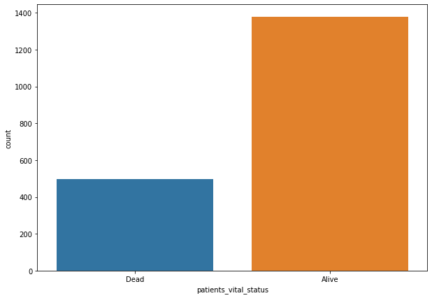

The minority class makes up a little less than 30% of target variables,
so there is some mild class imbalance. If the model always predicts 1,
it can achieve 73% accuracy.

I will choose to implement SMOTE for handling class imbalance as opposed
to random undersampling or random oversampling. Random undersampling the
majority class can lead to loss of information, and is not a great
choice when I have less than 2000 observations. Random oversampling may
introduce some bias and noise into the training data, as duplicating
samples may result in a biased representation of the original data
distribution.

Instead, I will implement SMOTE to handle class imbalance, which
introduces artificial data points drawn from the nearest neighbors of
the existing samples in the feature space. It is an oversampling
technique, so this will be done for the minority class. Furthermore, I
will be using the SMOTENC variation, which can handle categorical
features along with numerical features.

``` python
categorical_columns = [True if col in df.select_dtypes(object).columns and col != 'patients_vital_status' else False for col in df.columns]

sm = SMOTENC(categorical_features=categorical_columns, sampling_strategy='minority', random_state=10)
X_res, y_res = sm.fit_resample(df.loc[:, df.columns != 'patients_vital_status'].reset_index(drop=True), df['patients_vital_status'])
```

``` python
# keep data before oversampling
df_before_sampling = df.copy()

# reassign df to new sampled data set
df = X_res
df['target'] = y_res
```

``` python
fig, ax = plt.subplots(figsize=(10,7))
ax = sns.countplot(data=df, x='target');
```

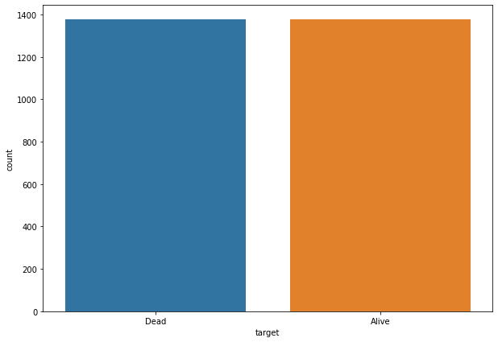

## Encoding Categorical Variables <a class="anchor" id="fourth-bullet"></a>

``` python
## plot value counts of categorical columns
fig, axs = plt.subplots(6, 2, figsize=(20,15), tight_layout=True)
for col, ax in zip(df.select_dtypes(object), axs.flat):
    sns.countplot(data=df, y=col, ax=ax)
```

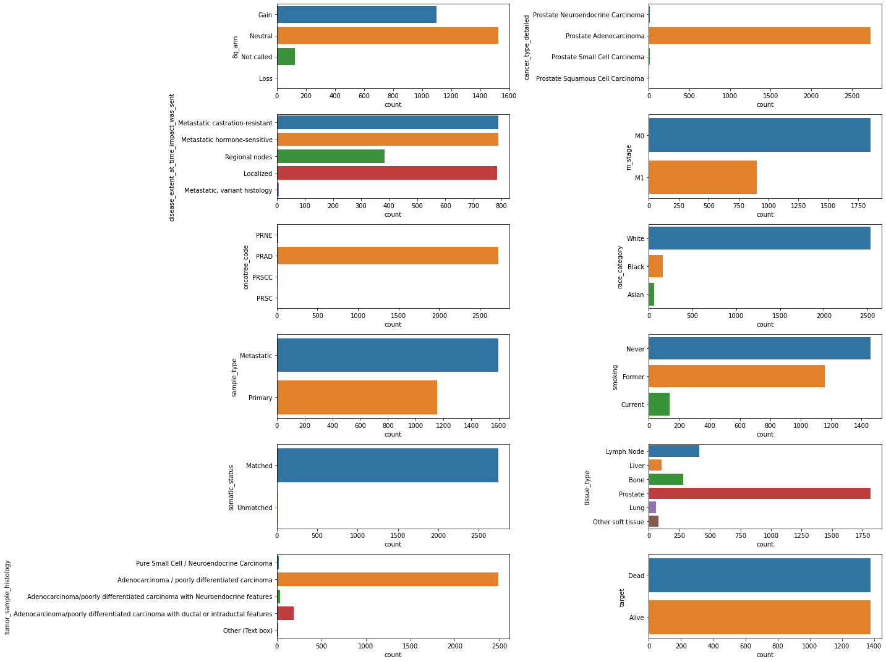

How I will encode the categorical variables:

A few of the columns are very imbalanced, such as oncotree_code,
somatic_status, and cancer_type_detailed, with the majority of
observations falling into one category. For these features, there may
not be enough training examples from minority classees for the model to
learn from, and therefore I will drop these columns.

Furthermore, the tumor_sample_histology, tissue_type, and race_category
columns are mostly consist of only one category, but there are few
observations that contain minority categories. For these columns, I will
turn them into a binary feature, so 1 will represent majority class, and
0 will represent not the majority class.

The m_stage category can be encoded ordinally with M0 = 0 and M1 = 1.

For the rest of the columns, there are not too many possible features,
so I will one hot encode them, it should not add too many additional
features to the data set.

``` python
# separate clinical and genomics features into their own data sets

df_clin = df[[col for col in df.columns if col in clinical_df.columns]]
df_genomic = df[[col for col in df.columns if col not in df_clin.columns]]

## all of the categorical features are in the clinical data set
```

``` python
# drop heavily imbalanced features
df_clin = df_clin.drop(columns=['somatic_status', 'cancer_type_detailed', 'oncotree_code'])

# binary encode other imbalanced features
df_clin['adenocarcinoma_poorly_diff_carcinoma_binary'] = [1 if hist == 'Adenocarcinoma / poorly differentiated carcinoma' else 0 for hist in df_clin['tumor_sample_histology'].values]
df_clin['prostate_tissue_binary'] = [1 if type == 'Prostate' else 0 for type in df_clin['tissue_type']]
df_clin['race_white'] = [1 if race == 'White' else 0 for race in df_clin['race_category']]
df_clin = df_clin.drop(columns=['tissue_type', 'tumor_sample_histology', 'race_category'])

# ordinal encode M Stage feature
df_clin['m_stage'] = df_clin['m_stage'].map({'M0':0, 'M1':1})
```

``` python
## one hot encoding

X = df_clin.copy()

X_categorical = X.select_dtypes(object) # separate categorical columns and apply one hot encoding
ohe = OneHotEncoder(drop='if_binary', sparse_output=False)
X_categorical_enc = ohe.fit_transform(X_categorical)
X_categorical_enc = pd.DataFrame(X_categorical_enc) # turn back to pandas dataframe
X_categorical_enc.columns = ohe.get_feature_names_out()


X_new = pd.concat([X[[col for col in X.columns if col not in ohe.feature_names_in_]].reset_index(), X_categorical_enc], axis = 1) # add encoded columns back to original dataframe
X_new.drop(columns='index', inplace=True)

df_clin = X_new
```

## Feature Selection <a class="anchor" id="fifth-bullet"></a>

I will perform feature selection on the genomic and clinical data
separately, then combine the datasets back together once the features
have been selected from each respective data set.

#### Genomic Data Feature Selection

``` python
df_genomic.shape
```

    (2752, 541)

``` python
## visualize how many copy number alterations (loss or gain) for each gene

mutation_counts = df_genomic.iloc[:,:-1].abs().sum(axis=0).sort_values(ascending=False).to_frame('abs_cna')
mutation_counts.hist(bins=100, figsize=(10,6))
plt.title('Number of Genomic Alterations by Gene')
plt.ylabel('Count')
plt.xlabel('Number of Alterations');
```

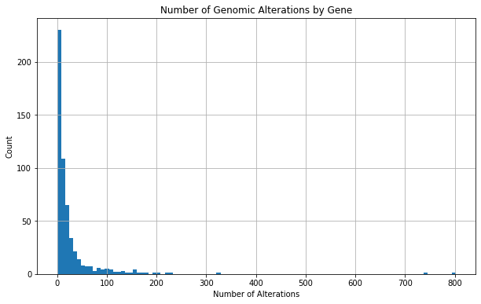

##### Drop all genes with 0 alterations in all samples

``` python
to_drop = mutation_counts.query('abs_cna == 0').index
df_genomic = df_genomic.drop(columns=to_drop)
print('Number of remaining features: {}'.format(len(df_genomic.columns)))
```

    Number of remaining features: 449

##### Checking for multicolinearity

``` python
corr_matrix = df_genomic.corr()
corr_pairs = pd.DataFrame([(corr_matrix.columns[i], corr_matrix.columns[j], corr_matrix.values[i,j])
                            for i in range(len(corr_matrix.columns)) 
                            for j in range(i+1,len(corr_matrix.columns)) 
                            if abs(corr_matrix.values[i,j]) > 0.8])

# Drop duplicate pairs
corr_pairs = corr_pairs[corr_pairs[0] < corr_pairs[1]]
corr_pairs = corr_pairs.drop_duplicates(subset=[0, 1])

print(corr_pairs)
```

                   0               1         2
    0           TAP1            TAP2  1.000000
    1           TAP1         TMEM127  1.000000
    3           MEN1         RPS6KA4  0.832240
    4           TAP2         TMEM127  1.000000
    10         CCND1            FGF4  0.813462
    11         CCND1           FGF19  0.872641
    14          IL7R          RICTOR  0.806917
    15        CDKN1A            PIM1  0.818291
    16         CSDE1            NRAS  0.906925
    17          MST1           SETD2  1.000000
    18          MST1            RHOA  1.000000
    21         PPARG            RAF1  0.849139
    23        MAP3K1            PLK2  0.804795
    26          RXRA           TRAF2  1.000000
    28        CTNNB1           MYD88  0.805322
    29        CTNNB1            MLH1  0.805322
    30          RYBP            SHQ1  0.896957
    32         CSF3R             MPL  1.000000
    33         CSF3R           MYCL1  0.829903
    38        CDKN2A    CDKN2Ap14ARF  0.937897
    39        CDKN2A  CDKN2Ap16INK4A  0.988912
    45        DNAJB1          NOTCH3  0.825572
    47         FANCC           PTCH1  1.000000
    50          MSH2            MSH6  0.823343
    53         AXIN2           CD79B  0.848225
    55  CDKN2Ap14ARF  CDKN2Ap16INK4A  0.924532
    57      HIST1H3B        HIST1H3C  1.000000
    64      HIST1H3F        HIST1H3G  1.000000
    67      HIST1H3F        HIST1H3H  0.853442
    70      HIST1H3G        HIST1H3H  0.853442
    71      HIST1H3D        HIST1H3E  0.838258
    73      HIST1H3E        HIST1H3H  0.853442
    77          JAK3            UPF1  0.875843
    80        PTPN11            SPEN  1.000000
    84         STAT3          STAT5B  0.908733
    85         STAT3          STAT5A  0.908733
    86       ALOX12B           AURKB  0.842868
    95           MPL           MYCL1  0.829903

``` python
# I will keep all the genes in the gene 1 column, and drop the correlated genes in gene 2 columns
to_drop = corr_pairs[1].values

df_genomic = df_genomic[[col for col in df_genomic.columns if col not in to_drop]]

print('Number of features remaining: {}'.format(len(df_genomic.columns)))
```

    Number of features remaining: 416

##### Feature selection Using L1 regularization

``` python
## First find the best regularized logistic regression model using grid search
## I wil be using L1 regularization (LASSO), as it shrinks coefficients to 0

X, y = df_genomic.iloc[:,:-1], df_genomic['target']
X_scaled = StandardScaler().fit_transform(X)
X_scaled = pd.DataFrame(X_scaled, columns=X.columns)

lr = LogisticRegression(solver='liblinear', max_iter=400, penalty='l1', random_state=3)
params = [{
    'C' : [0.001, 0.005, 0.01, 0.05, 0.1, 0.5, 1]  # the smaller the C, the stronger the penalty
}]

gs = GridSearchCV(estimator=lr, param_grid=params, cv=KFold(n_splits=5, shuffle=True, random_state=42), scoring='roc_auc')
gs.fit(X_scaled, y)
gs.best_estimator_
```

``` python
lr_lasso = LogisticRegression(solver='liblinear', max_iter=400, penalty='l1', C=1, random_state=3)
lr_lasso.fit(X_scaled, y)

lasso_features_df = pd.DataFrame({
   'coefficients' : lr_lasso.coef_.ravel(),
   'features' : lr_lasso.feature_names_in_
})

lasso_features_df.head(10)
```

<div>

|     | coefficients | features |
|-----|--------------|----------|
| 0   | 0.239968     | TAP1     |
| 1   | 0.463515     | ERRFI1   |
| 2   | 0.081970     | STK19    |
| 3   | 0.000000     | CRKL     |
| 4   | -0.022052    | STK11    |
| 5   | 0.000000     | MEN1     |
| 6   | -0.471264    | B2M      |
| 7   | 0.145135     | PMAIP1   |
| 8   | 0.000000     | CDC73    |
| 9   | 0.094959     | PIK3CA   |

</div>

Keep the features with non-zero coefficients determined by lasso
regularization

``` python
X_scaled = X_scaled[lasso_features_df.query('coefficients != 0').features.values]
print('Number of remaining features: {}'.format(len(X_scaled.columns)))
```

    Number of remaining features: 307

##### Filter remaining genes through Boruta algorithm

``` python
## First find best Random Forest model using 5-fold cross validation

rf = RandomForestClassifier(n_jobs=-1, random_state=3)
params = [{
    'criterion' : ['gini', 'entropy', 'log_loss'],
    'max_depth' : list(range(5, 11, 1)),
    'n_estimators' : list(range(100, 501, 100))
}]

gs = GridSearchCV(estimator=rf, param_grid=params, cv=KFold(n_splits=5, shuffle=True, random_state=42), scoring='roc_auc')
gs.fit(X_scaled, y)
gs.best_estimator_
```

``` python
rf = RandomForestClassifier(n_jobs=-1, max_depth=10, criterion='log_loss', n_estimators=500, random_state=3)
rf.fit(X_scaled, y)

boruta = BorutaPy(rf, n_estimators='auto', verbose=0, random_state=10, alpha=0.01)
boruta.fit(X_scaled.values, y)
```

``` python
boruta_df = pd.DataFrame({
    'column' : X_scaled.columns,
    'Rank' : boruta.ranking_,
    'Keep' : boruta.support_
})

boruta_df[boruta_df['Keep'] == True]
```

<div>

|     | column  | Rank | Keep |
|-----|---------|------|------|
| 16  | CCND1   | 1    | True |
| 19  | PTEN    | 1    | True |
| 90  | RECQL4  | 1    | True |
| 96  | CCNE1   | 1    | True |
| 118 | TET1    | 1    | True |
| 130 | MCL1    | 1    | True |
| 138 | RB1     | 1    | True |
| 161 | BRCA2   | 1    | True |
| 164 | MDM2    | 1    | True |
| 190 | TP53    | 1    | True |
| 200 | TCEB1   | 1    | True |
| 218 | ANKRD11 | 1    | True |
| 231 | AKT1    | 1    | True |
| 238 | MYC     | 1    | True |
| 254 | AMER1   | 1    | True |
| 261 | FGF3    | 1    | True |
| 280 | NBN     | 1    | True |
| 299 | AR      | 1    | True |

</div>

PTEN, TP53, AR, BRCA2, and MYC are some commonly implicated genes in
prostate cancer

``` python
top_genes = boruta_df[boruta_df['Keep'] == True]['column']
```

``` python
df_genomic_filt = df_genomic[top_genes]
print('Number of remaining features: {}'.format(len(df_genomic_filt.columns)))
```

    Number of remaining features: 18

#### Clinical Data Feature Selection

Check for multicolinearity

``` python
corr = df_clin.corr().round(2)

mask = np.zeros_like(corr, dtype=np.bool)
mask[np.triu_indices_from(mask)] = True

fig, ax = plt.subplots(figsize=(20, 20))
cmap = sns.diverging_palette(220, 10, as_cmap=True)

sns.heatmap(corr, mask=mask, cmap=cmap, square=True, linewidths=0.5, cbar_kws={'shrink':0.5}, annot=True)
plt.tight_layout()
```

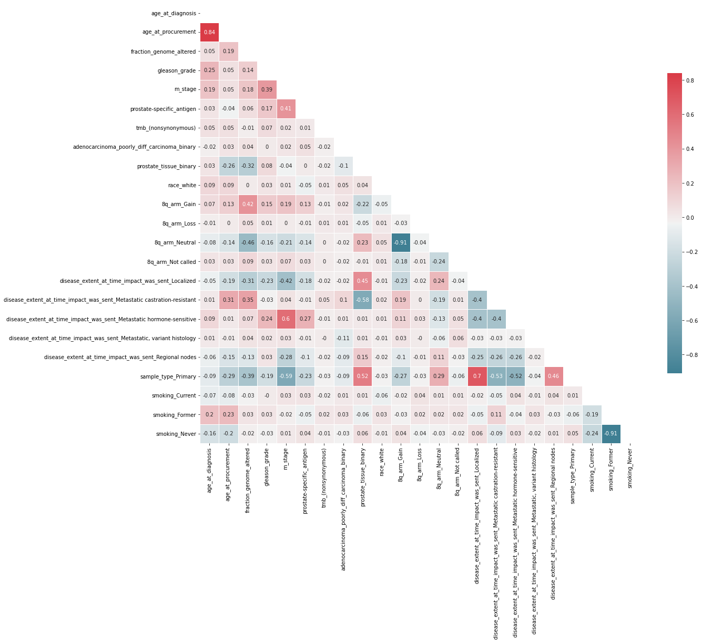

Age at diagnosis and age at procurement are correlated, which is
expected. I will drop the age at procurement.

Additionally, some of the dummy variables that I created are correlated
with each other, as expected (known as the dummy variable trap). To
avoid this, I will have to drop one of the dummy variables from each
category. Since the dummy variables were created by binary encoding each
of the possible categories, the last category can be inferred with a 0
value in all the other categories. 8q_arm_Neutral and 8q_arm_Gain are
highly correlated, so I will drop 8q_arm_Neutral. The dummy variables
smoking_Current and smoking_Former are also negatively correlated, so I
will drop smoking_Never.

Furthermore, the sample type is correlated with the disease extent at a
correlation coefficient of 0.7. This makes sense, as the sample type is
either primary or metastatic, and there cannot be a metastatic sample if
the disease was localized. I will remove the localized disease extent
column.

``` python
to_drop = ['disease_extent_at_time_impact_was_sent_Localized', 'age_at_procurement', 'smoking_Never', '8q_arm_Neutral']
df_clin.drop(columns=to_drop, inplace=True)
```

Recheck correlations

``` python
corr = df_clin.corr().round(2)

mask = np.zeros_like(corr, dtype=np.bool)
mask[np.triu_indices_from(mask)] = True

fig, ax = plt.subplots(figsize=(20, 20))
cmap = sns.diverging_palette(220, 10, as_cmap=True)

sns.heatmap(corr, mask=mask, cmap=cmap, square=True, linewidths=0.5, cbar_kws={'shrink':0.5}, annot=True)
plt.tight_layout()
```

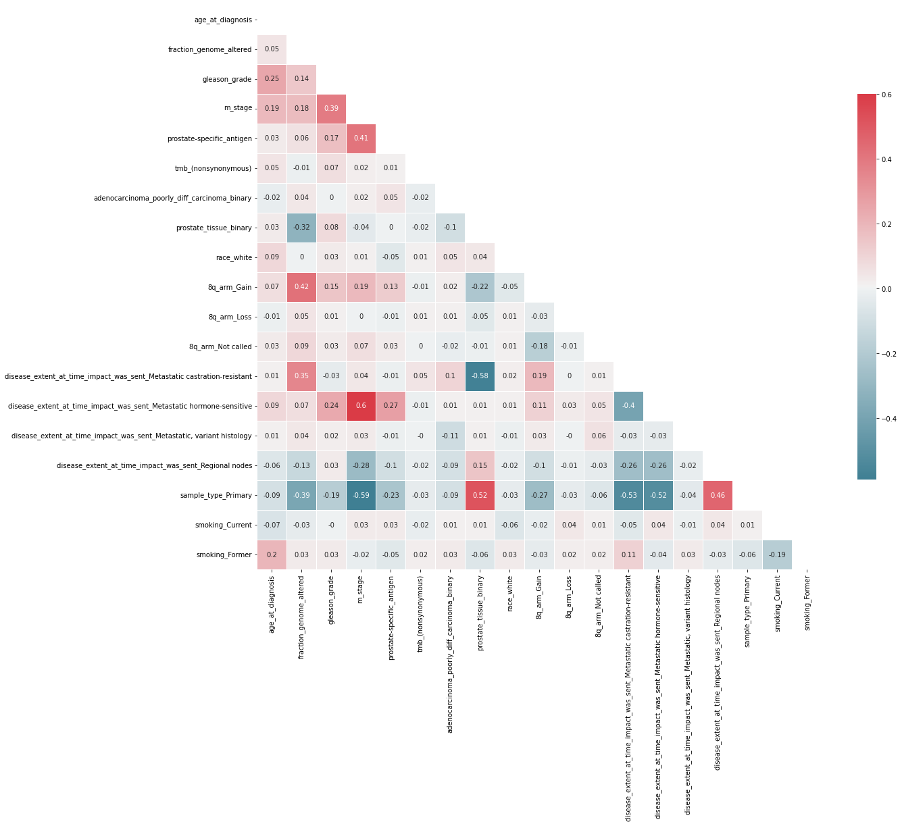

``` python
df_clin.shape
```

    (2752, 19)

``` python
X, y = df_clin, df_genomic['target'].map({'Dead' : 0, 'Alive' : 1})
```

``` python
X_train, X_test, y_train, y_test = train_test_split(X, y, random_state=3)

scaler = StandardScaler()
scaler.fit(X_train)
X_train, X_test = scaler.transform(X_train), scaler.transform(X_test)
```

``` python
lr = LogisticRegression(penalty=None, random_state=3)
lr.fit(X_train, y_train)

print('Training accuracy: {}'.format(lr.score(X_train, y_train)))
print('Testing accuracy: {}'.format(lr.score(X_test, y_test)))

cm = confusion_matrix(y_test, lr.predict(X_test))

def plot_confusion_matrix(cm):

    # modify confusion matrix
    modified_cm = []
    for index,value in enumerate(cm):
        if index == 0:
            modified_cm.append(['TN = ' + str(value[0]), 'FP = ' + str(value[1])])
        if index == 1:
            modified_cm.append(['FN = ' + str(value[0]), 'TP = ' + str(value[1])])

    # plot
    plt.figure(figsize=(7,7))
    sns.heatmap(cm, annot=np.array(modified_cm), cmap='Blues', fmt='', annot_kws={'size':20}, 
                linewidths=0.5, square=True, xticklabels=['Dead', 'Alive'], yticklabels=['Dead', 'Alive']);
    plt.ylabel('Actual', fontsize=17)
    plt.xlabel('Predicted', fontsize=17)
    plt.tick_params(labelsize=15)

plot_confusion_matrix(cm)
```

    Training accuracy: 0.7766472868217055
    Testing accuracy: 0.7601744186046512

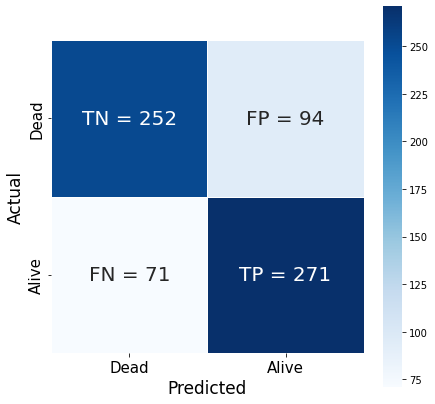

Looks like the baseline Logistic Regression model achieved 76% accuracy
using all the features.

Lets see if including some regularization parameters can help select the
most informative features.

Below, I test different regularization method and regularization
strengths and extract the optimal parameters. The `C` parameter is the
inverse strength of regularization, so decreasing `C` increases the
regularization coefficient. I use elastic net regularization, which is a
combination of L1 and L2 regularization. The l1 ratio parameter
determines how much strong the L1 regularization is and is complementary
to the strength of the L2 regularization. The values range between 0 and
1, with 0 being the same as only L2 regularization and 1 being the same
as only L1 regularization.

##### Feature selection using elasticnet

``` python
X_scaled = StandardScaler().fit_transform(X)
params = {
    'C' : [0.001, 0.005, 0.01, 0.05, 0.1, 0.5],
    'l1_ratio' : [0, 0.2, 0.4, 0.6, 0.8, 1]
}
lr = LogisticRegression(solver='saga', penalty='elasticnet', max_iter=900, random_state=12)
gs = GridSearchCV(estimator=lr, param_grid=params, cv=KFold(n_splits=5, shuffle=True, random_state=42), n_jobs=-1, scoring='roc_auc')
gs.fit(X_scaled, y)

gs.best_estimator_
```


``` python
lr = LogisticRegression(C=0.1, l1_ratio=0.6, max_iter=900, penalty='elasticnet', solver='saga', random_state=3)
lr.fit(X_scaled, y)
```

``` python
enet_df = pd.DataFrame({
    'column' : X.columns,
    'coefficient' : np.abs(lr.coef_.ravel())
}).sort_values('coefficient', ascending=False)

enet_df
```

<div>

|     | column                                            | coefficient |
|-----|---------------------------------------------------|-------------|
| 12  | disease_extent_at_time_impact_was_sent_Metasta... | 0.864968    |
| 16  | sample_type_Primary                               | 0.621489    |
| 1   | fraction_genome_altered                           | 0.571824    |
| 7   | prostate_tissue_binary                            | 0.501981    |
| 6   | adenocarcinoma_poorly_diff_carcinoma_binary       | 0.344367    |
| 8   | race_white                                        | 0.249705    |
| 2   | gleason_grade                                     | 0.208185    |
| 18  | smoking_Former                                    | 0.156965    |
| 4   | prostate-specific_antigen                         | 0.119296    |
| 14  | disease_extent_at_time_impact_was_sent_Metasta... | 0.103656    |
| 11  | 8q_arm_Not called                                 | 0.090525    |
| 13  | disease_extent_at_time_impact_was_sent_Metasta... | 0.083132    |
| 15  | disease_extent_at_time_impact_was_sent_Regiona... | 0.064292    |
| 17  | smoking_Current                                   | 0.049983    |
| 3   | m_stage                                           | 0.047587    |
| 5   | tmb\_(nonsynonymous)                              | 0.046656    |
| 9   | 8q_arm_Gain                                       | 0.033725    |
| 10  | 8q_arm_Loss                                       | 0.000667    |
| 0   | age_at_diagnosis                                  | 0.000000    |

</div>

#### Feature selection using Boruta algorithm

``` python
## First find best Random Forest model using 5-fold cross validation

rf = RandomForestClassifier(n_jobs=-1, random_state=3)
params = [{
    'criterion' : ['gini', 'entropy', 'log_loss'],
    'max_depth' : list(range(5, 11, 1)),
    'n_estimators' : list(range(100, 501, 100))
}]

gs = GridSearchCV(estimator=rf, param_grid=params, cv=KFold(n_splits=5, shuffle=True, random_state=42), scoring='roc_auc')
gs.fit(X_scaled, y)
gs.best_estimator_
```

``` python
rf = RandomForestClassifier(n_jobs=-1, max_depth=10, n_estimators=400, random_state=3)
rf.fit(X_scaled, y)

boruta = BorutaPy(rf, n_estimators='auto', verbose=0, random_state=12)
boruta.fit(X_scaled, y)
```

``` python
boruta_df = pd.DataFrame({
    'column' : X.columns,
    'Rank' : boruta.ranking_,
    'Keep' : boruta.support_
})
```

``` python
clin_features_df = pd.merge(boruta_df, enet_df).sort_values('coefficient', ascending=False)
clin_features_df
```

<div>

|     | column                                            | Rank | Keep  | coefficient |
|-----|---------------------------------------------------|------|-------|-------------|
| 12  | disease_extent_at_time_impact_was_sent_Metasta... | 1    | True  | 0.864968    |
| 16  | sample_type_Primary                               | 1    | True  | 0.621489    |
| 1   | fraction_genome_altered                           | 1    | True  | 0.571824    |
| 7   | prostate_tissue_binary                            | 3    | False | 0.501981    |
| 6   | adenocarcinoma_poorly_diff_carcinoma_binary       | 6    | False | 0.344367    |
| 8   | race_white                                        | 9    | False | 0.249705    |
| 2   | gleason_grade                                     | 1    | True  | 0.208185    |
| 18  | smoking_Former                                    | 8    | False | 0.156965    |
| 4   | prostate-specific_antigen                         | 1    | True  | 0.119296    |
| 14  | disease_extent_at_time_impact_was_sent_Metasta... | 12   | False | 0.103656    |
| 11  | 8q_arm_Not called                                 | 11   | False | 0.090525    |
| 13  | disease_extent_at_time_impact_was_sent_Metasta... | 2    | False | 0.083132    |
| 15  | disease_extent_at_time_impact_was_sent_Regiona... | 5    | False | 0.064292    |
| 17  | smoking_Current                                   | 10   | False | 0.049983    |
| 3   | m_stage                                           | 4    | False | 0.047587    |
| 5   | tmb\_(nonsynonymous)                              | 1    | True  | 0.046656    |
| 9   | 8q_arm_Gain                                       | 7    | False | 0.033725    |
| 10  | 8q_arm_Loss                                       | 13   | False | 0.000667    |
| 0   | age_at_diagnosis                                  | 1    | True  | 0.000000    |

</div>

Boruta and regularization gave varying results. Regularization ended up
not shrinking any of the variables to 0 but 1. I will drop the features
that were deemed to not keep by Bourta.

``` python
to_drop = clin_features_df.query('Keep == False')['column'].values
df_clin_filt = df_clin[[col for col in df_clin.columns if col not in to_drop]]
```

## Model Building <a class="anchor" id="sixth-bullet"></a>

``` python
df = pd.concat([df_clin_filt, df_genomic_filt, y], axis=1)
df.head()
```

<div>

|     | age_at_diagnosis | fraction_genome_altered | gleason_grade | prostate-specific_antigen | tmb\_(nonsynonymous) | disease_extent_at_time_impact_was_sent_Metastatic castration-resistant | sample_type_Primary | CCND1 | PTEN | RECQL4 | ... | TP53 | TCEB1 | ANKRD11 | AKT1 | MYC | AMER1 | FGF3 | NBN | AR  | target |
|-----|------------------|-------------------------|---------------|---------------------------|----------------------|------------------------------------------------------------------------|---------------------|-------|------|--------|-----|------|-------|---------|------|-----|-------|------|-----|-----|--------|
| 0   | 42.6             | 0.5462                  | 4.0           | 4.4                       | 1.109155             | 1.0                                                                    | 0.0                 | 0.0   | -1.5 | 0.0    | ... | -1.5 | 0.0   | 0.0     | 0.0  | 0.0 | 0.0   | 0.0  | 0.0 | 0.0 | 0      |
| 1   | 79.6             | 0.0604                  | 4.0           | 211.0                     | 3.327466             | 1.0                                                                    | 0.0                 | 0.0   | 0.0  | 0.0    | ... | 0.0  | 0.0   | 0.0     | 0.0  | 0.0 | 0.0   | 0.0  | 0.0 | 0.0 | 0      |
| 2   | 54.9             | 0.0023                  | 5.0           | 5.8                       | 1.109155             | 0.0                                                                    | 0.0                 | 0.0   | 0.0  | 0.0    | ... | 0.0  | 0.0   | 0.0     | 0.0  | 0.0 | 0.0   | 0.0  | 0.0 | 0.0 | 0      |
| 3   | 60.0             | 0.5102                  | 5.0           | 3.0                       | 6.654932             | 1.0                                                                    | 0.0                 | 0.0   | 0.0  | 0.0    | ... | 0.0  | 0.0   | 0.0     | 0.0  | 0.0 | 0.0   | 0.0  | 0.0 | 0.0 | 0      |
| 4   | 45.5             | 0.0134                  | 3.0           | 27.4                      | 1.109155             | 0.0                                                                    | 1.0                 | 0.0   | 0.0  | 0.0    | ... | 0.0  | 0.0   | 0.0     | 0.0  | 0.0 | 0.0   | 0.0  | 0.0 | 0.0 | 1      |

<p>5 rows × 26 columns</p>
</div>

``` python
X, y = df.loc[:, df.columns != 'target'], df['target']
X_train, X_test, y_train, y_test = train_test_split(X, y, random_state=88, test_size=0.3) # 70-30 split
```

``` python
models = {
    'logistic_regression' : {
        'pipe' : Pipeline([('scaler', StandardScaler()), ('LR', LogisticRegression(penalty='elasticnet', random_state=42, solver='saga', max_iter=2000))]),
        'param_grid' : [{
            'LR__C' : [0.0001, 0.001, 0.01, 0.1, 1, 10, 100],
            'LR__l1_ratio' : [0, 0.2, 0.4, 0.6, 0.8, 1]
        }]
    },
    'decision_tree' : {
        'pipe' : Pipeline([('scaler', StandardScaler()), ('DT', DecisionTreeClassifier(random_state=42))]),
        'param_grid' : [{
            'DT__criterion' : ['gini', 'entropy', 'log_loss'],
            'DT__max_depth' : list(range(5, 16, 2))
        }]
    },
    'random_forest' : {
        'pipe' : Pipeline([('scaler', StandardScaler()), ('RF', RandomForestClassifier(random_state=42))]),
        'param_grid' : [{
            'RF__criterion' : ['gini', 'entropy', 'log_loss'],
            'RF__max_depth' : list(range(5, 16, 2)),
            'RF__n_estimators' : list(range(100, 501, 100))
        }]
    },
    'knn' : {
        'pipe' : Pipeline([('scaler', StandardScaler()), ('KNN', KNeighborsClassifier())]),
        'param_grid' : [{
            'KNN__n_neighbors' : [5, 10, 15, 20],
            'KNN__weights' : ['uniform', 'distance']
        }]
    },
    'svm' : {
        'pipe' : Pipeline([('scaler', StandardScaler()), ('SVM', SVC(random_state=42))]),
        'param_grid' : [{
                'SVM__C' : [0.0001, 0.001, 0.01, 0.1, 1, 10, 100],
                'SVM__kernel' : ['linear', 'poly', 'rbf', 'sigmoid'],
                'SVM__degree' : [3, 4, 5, 6, 7, 8],
                'SVM__gamma' : ['scale', 'auto']
        }]
    },
    'xgb' : {
        'pipe' : Pipeline([('scaler', StandardScaler()), ('XGB', XGBClassifier(random_state=42))]),
        'param_grid' : [{
            'XGB__learning_rate' : [0.01, 0.05, 0.1, 0.2, 0.3],
            'XGB__max_depth' : list(range(5, 16, 2)),
            'XGB__n_estimators' : list(range(100, 501, 100))
        }]
    }
}
```

``` python
res = []
for mod, args in models.items():
    gs = GridSearchCV(estimator=args['pipe'], 
                      param_grid=args['param_grid'], 
                      scoring=['accuracy', 'roc_auc'], 
                      n_jobs=-1, 
                      cv=KFold(n_splits=10, shuffle=True, random_state=40), 
                      return_train_score=True, 
                      refit='roc_auc')
    gs.fit(X_train, y_train)
    res.append({'model' : mod, 'best_parameters' : gs.best_params_, 'score' : gs.best_score_})
```

``` python
pd.DataFrame(res)
```

<div>

|     | model               | best_parameters                                         | score    |
|-----|---------------------|---------------------------------------------------------|----------|
| 0   | logistic_regression | {'LR\_\_C': 0.001, 'LR\_\_l1_ratio': 0}                 | 0.819021 |
| 1   | decision_tree       | {'DT\_\_criterion': 'entropy', 'DT\_\_max_depth': 5}    | 0.824251 |
| 2   | random_forest       | {'RF\_\_criterion': 'entropy', 'RF\_\_max_depth': ...   | 0.906831 |
| 3   | knn                 | {'KNN\_\_n_neighbors': 5, 'KNN\_\_weights': 'dista...   | 0.847111 |
| 4   | svm                 | {'SVM\_\_C': 10, 'SVM\_\_degree': 3, 'SVM\_\_gamma':... | 0.841943 |
| 5   | xgb                 | {'XGB\_\_learning_rate': 0.1, 'XGB\_\_max_depth': ...   | 0.923706 |

</div>

``` python
res
```

    [{'model': 'logistic_regression',
      'best_parameters': {'LR__C': 0.001, 'LR__l1_ratio': 0},
      'score': 0.8190207677968658},
     {'model': 'decision_tree',
      'best_parameters': {'DT__criterion': 'entropy', 'DT__max_depth': 5},
      'score': 0.8242512199473317},
     {'model': 'random_forest',
      'best_parameters': {'RF__criterion': 'entropy',
       'RF__max_depth': 15,
       'RF__n_estimators': 500},
      'score': 0.9068311391533369},
     {'model': 'knn',
      'best_parameters': {'KNN__n_neighbors': 5, 'KNN__weights': 'distance'},
      'score': 0.8471109487620518},
     {'model': 'svm',
      'best_parameters': {'SVM__C': 10,
       'SVM__degree': 3,
       'SVM__gamma': 'scale',
       'SVM__kernel': 'rbf'},
      'score': 0.8419430350900058},
     {'model': 'xgb',
      'best_parameters': {'XGB__learning_rate': 0.1,
       'XGB__max_depth': 5,
       'XGB__n_estimators': 200},
      'score': 0.9237063864400394}]

It looks like XGBoost performed with the top score out of all the
classifiers with AUC = 0.92. Random Forest also performed well with AUC
= 0.90.

#### XGBoost Model

``` python
scaler = StandardScaler()
X_train = scaler.fit_transform(X_train)
X_test = scaler.transform(X_test)

xgb = XGBClassifier(learning_rate=0.1, max_depth=5, n_estimators=200, random_state=42)
xgb.fit(X_train, y_train)
print('Training accuracy: {}'.format(xgb.score(X_train, y_train)))
print('Testing accuracy: {}'.format(xgb.score(X_test, y_test)))
```

    Training accuracy: 0.9719626168224299
    Testing accuracy: 0.851089588377724

``` python
cm = confusion_matrix(y_test, xgb.predict(X_test))

plot_confusion_matrix(cm)
plt.title('XGBoost model', fontsize=20);
```

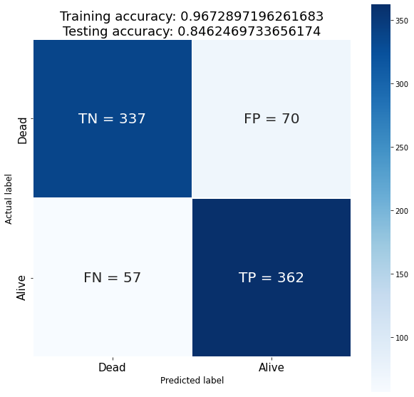

``` python
y_pred_proba = xgb.predict_proba(X_test)[::,-1]

fpr, tpr, _ = roc_curve(y_test, y_pred_proba)

fig, ax = plt.subplots(figsize=(10,7))
ax.plot(fpr, tpr)
ax.set_ylabel('True Positive Rate')
ax.set_xlabel('False Positive Rate')
ax.set_title('AUC = ' + str(roc_auc_score(y_test, y_pred_proba)));
```

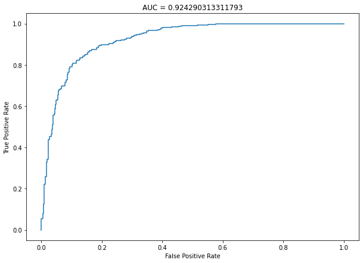

#### Random Forest Model

``` python
rf = RandomForestClassifier(max_depth=15, n_estimators=500, criterion='entropy', random_state=42)
rf.fit(X_train, y_train)
print('Training accuracy: {}'.format(rf.score(X_train, y_train)))
print('Testing accuracy: {}'.format(rf.score(X_test, y_test)))
```

    Training accuracy: 0.9755970924195223
    Testing accuracy: 0.8329297820823245

``` python
cm = confusion_matrix(y_test, rf.predict(X_test))
plot_confusion_matrix(cm)
plt.title('Random Forest model', fontsize=20);
```

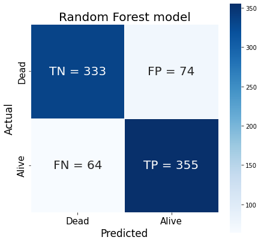

``` python
y_pred_proba = rf.predict_proba(X_test)[::,-1]

fpr, tpr, _ = roc_curve(y_test, y_pred_proba)

fig, ax = plt.subplots(figsize=(10,7))
ax.plot(fpr, tpr)
ax.set_ylabel('True Positive Rate')
ax.set_xlabel('False Positive Rate')
ax.set_title('AUC = ' + str(roc_auc_score(y_test, y_pred_proba)));
```


## Hyperparameter Tuning <a class="anchor" id="seventh-bullet"></a>

The top performing models are both tree models, and judging from the
high training accuracy (0.93 for XGBoost and 0.97 for Random Forest)
they are overfitting.

I will use ‘roc_auc’ for the scoring metric because optimizing this
metric helps to control overfitting more than by optimizing for
accuracy.

XGBoost has some penalty parameters that can be tuned to help with
overfitting such as lambda and alpha.

#### XGBoost Hyperparameter Tuning

``` python
params = {
    'max_depth': [3, 5, 8], 
    'learning_rate' : [0.01, 0.03, 0.05], # smaller makes more robust to overfitting
    'colsample_bytree': [0.5, 0.8, 1.0], # fraction of features that are sampled to train each tree
    'reg_alpha': [0, 0.5, 1, 1.5],     # L1 regularization, default 0
    'reg_lambda': [1, 1.5, 2],    # L2 regularization, default 1
    'gamma': [0, 0.1, 0.5]  # minimum reduction in loss
}

gs = GridSearchCV(estimator=xgb, 
                  param_grid=params, 
                  scoring='roc_auc', 
                  n_jobs=-1, 
                  cv=KFold(n_splits=10, shuffle=True, random_state=40)
                  )
gs.fit(X_train, y_train)
```

``` python
gs.best_params_
```

    {'colsample_bytree': 0.5,
     'gamma': 0.5,
     'learning_rate': 0.05,
     'max_depth': 5,
     'reg_alpha': 0,
     'reg_lambda': 1.5}

``` python
gs.best_score_
```

    0.9246999258518702

``` python
xgb_final = XGBClassifier(learning_rate=0.05, 
                          max_depth=5, 
                          n_estimators=200, 
                          random_state=66,
                          colsample_bytree=0.5,
                          gamma=0,
                          reg_alpha=0,
                          reg_lambda=1,
                          subsample=1)

xgb_final.fit(X_train, y_train)
print('Training accuracy: {}'.format(xgb_final.score(X_train, y_train)))
print('Testing accuracy: {}'.format(xgb_final.score(X_test, y_test)))
```

    Training accuracy: 0.9247144340602285
    Testing accuracy: 0.8389830508474576

It appears that the training accuracy went down a bit, so the model is
slightly less overfit, and the testing accuracy did not decrease too
much!

``` python
cm = confusion_matrix(y_test, xgb_final.predict(X_test))
plot_confusion_matrix(cm)
```


``` python
y_pred_proba = xgb_final.predict_proba(X_test)[::,-1]

fpr, tpr, _ = roc_curve(y_test, y_pred_proba)

fig, ax = plt.subplots(figsize=(10,7))
ax.plot(fpr, tpr)
ax.set_ylabel('True Positive Rate')
ax.set_xlabel('False Positive Rate')
ax.set_title('Testing AUC = ' + str(roc_auc_score(y_test, y_pred_proba)));
```

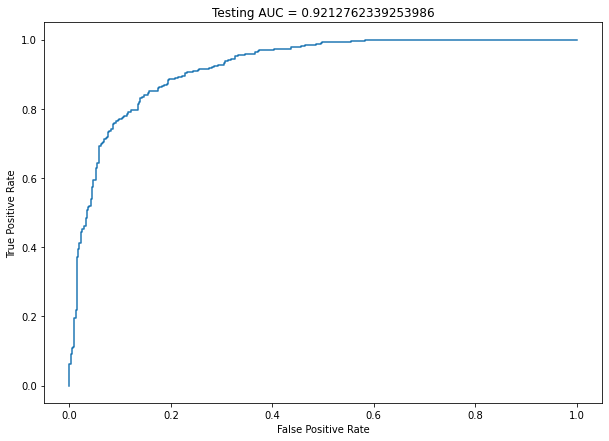

#### Random Forest Hyperparameter Tuning

``` python
params = {
    'min_samples_split': [2, 4, 6, 8],
    'max_features': ['sqrt', 'log2', None],
    'min_samples_leaf': [1, 3, 5],
    'max_leaf_nodes' : [None, 2, 4, 6]
}

gs = GridSearchCV(
    estimator=rf, 
    param_grid=params, 
    scoring='roc_auc', 
    n_jobs=-1, 
    cv=KFold(n_splits=10, shuffle=True, random_state=40)
)
gs.fit(X_train, y_train)
```

``` python
gs.best_estimator_.get_params()
```

    {'bootstrap': True,
     'ccp_alpha': 0.0,
     'class_weight': None,
     'criterion': 'entropy',
     'max_depth': 15,
     'max_features': 'sqrt',
     'max_leaf_nodes': None,
     'max_samples': None,
     'min_impurity_decrease': 0.0,
     'min_samples_leaf': 1,
     'min_samples_split': 2,
     'min_weight_fraction_leaf': 0.0,
     'n_estimators': 500,
     'n_jobs': None,
     'oob_score': False,
     'random_state': 42,
     'verbose': 0,
     'warm_start': False}

``` python
print(gs.best_score_)
```

    0.9070158396280217

``` python
rf_final = RandomForestClassifier(
    max_depth=15, max_features='sqrt', min_samples_leaf=1, min_samples_split=2,
    n_estimators=500, n_jobs=-1, random_state=29, criterion='entropy'
)

rf_final.fit(X_train, y_train)
print('Training accuracy: {}'.format(rf_final.score(X_train, y_train)))
print('Testing accuracy: {}'.format(rf_final.score(X_test, y_test)))
```

    Training accuracy: 0.9724818276220145
    Testing accuracy: 0.8305084745762712

It appears that even after hyperparameter tuning, the random forest
model is still overfitting the training data. The XGBoost model may be
the better choice for this problem if there is no additional data
available.

``` python
cm = confusion_matrix(y_test, rf_final.predict(X_test))
plot_confusion_matrix(cm)
```

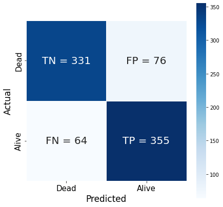

``` python
y_pred_proba = rf_final.predict_proba(X_test)[::,-1]

fpr, tpr, _ = roc_curve(y_test, y_pred_proba)

fig, ax = plt.subplots(figsize=(10,7))
ax.plot(fpr, tpr)
ax.set_ylabel('True Positive Rate')
ax.set_xlabel('False Positive Rate')
ax.set_title('Testing AUC = ' + str(roc_auc_score(y_test, y_pred_proba)));
```

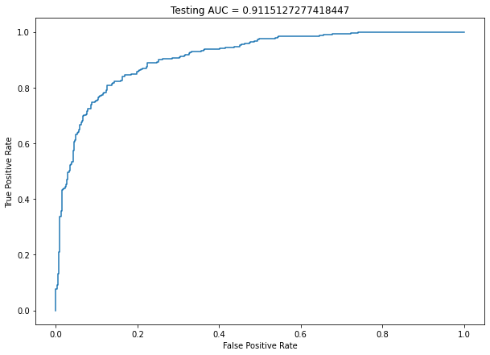

Overall, the XGBoost model performed the best in predicting the
patients’ outcomes, achieving an AUC score of 0.92 on the testing set.
